# JS Applications Exam - Our Luxury Cars SPA (12.12.2023)

In this exam, you are expected to exclusively utilize JavaScript without relying on external frameworks like React, Vue, or Angular to tackle the given challenges. 
You are assigned to implement a Web application (SPA) using JavaScript. The application should dynamically display content, based on user interaction and support user-profiles and CRUD operations, using a REST service.

## 1\. Overview

Implement a front-end app (SPA) for creating and managing cars records. The application allows visitors to browse through the Our Cars catalog. Users may register with an email and a password which allows them to create their own car records info. Car authors can also edit or delete their own publications at any time.

## 2\. Technical Details

You are provided with the following resources:
- Project scaffold: A package.json file, containing a list of common dependencies. You may change the included libraries to your preference. The sections devDependencies and scripts of the file are used by the automated testing suite, altering them may result in an incorrect test operation.
To initialize the project, execute the command npm install via the command-line terminal.

- HTML and CSS files: All views (pages) of the application, including sample user-generated content, are included in the file index.html, which links to CSS and other static files. Each view is in a separate section of the file, which can be identified by a unique class name or id attribute. Your application may use any preferred method (such as a templates library or manual visibility settings) to display only the selected view and to navigate between views upon user interaction.

- Local REST service: A special server, which contains sample data and supports user registration and CRUD operations via REST requests is included in the project. Each section of this document (where applicable) includes details about the necessary REST endpoints, to which requests must be sent, and the shape of the expected request body.

For more information on how to use the included server, see Appendix A: Using the Local REST Service at the end of this document.

- Automated tests: A complete test suite is included, which can be used to test the correctness of your solution. Your work will be assessed, based on these tests.
For more information on how to run the tests, see Appendix B: Running the Test Suite at the end of this document.

Do not use CDN for loading the dependencies because it can affect the tests in a negative way!

**Note:** When creating HTML elements and displaying them on the page, adhere as close as possible to the provided HTML samples. Changing the structure of the document may prevent the tests from running correctly, which will adversely affect your assessment grade. You may add attributes (such as class and dataset) to any HTML Element, as well as change the "href" attributes on links and add/change the method and action attributes of HTML Forms, to facilitate the correct operation of a routing library or another method of abstraction. You may also add hidden elements to help you implement certain parts of the application requirements.

## 3\. Application Requirements

### Navigation Bar (5 pts)

Implement a NavBar for the app:
Navigation links should correctly change the current page (view). All users can see the site logo that should be a link to the Home page as well as the navigation link to Our Cars page. Guests (un-authenticated visitors) can see the links to the Login and Register and Search pages. The logged-in user navbar should contain the links to the Add Your Car, Search pages and a link for the Logout action.

Logged-in User navigation example:

Guest navigation example:

### Home Page (10 pts)

Implement a static Home page for the app using the structure for it from the given resources.

### Login Page (5 pts)

The included REST service comes with the following premed user accounts, which you may use for development:
{ "email": "peter@abv.bg", "password": "123456" }
{ "email": "john@abv.bg", "password": "123456" }

The Login page contains a form for existing user authentication. By providing an email and password the app should log a user in the system if there are no empty fields.

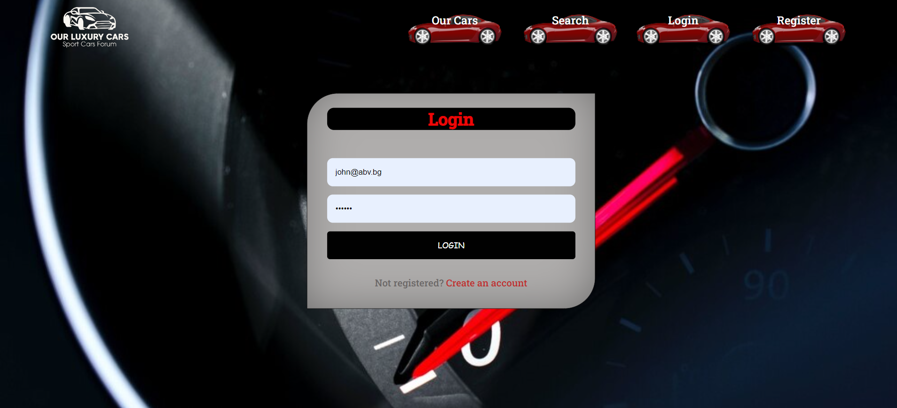

Send the following request to perform login:
Method: POST
URL: /users/login

The required headers are described in the documentation. The service expects a body with the following shape:
{
email,
password
}
Upon success, the REST service will return the newly created object with an automatically generated \_id and a property accessToken, which contains the session token for the user – you need to store this information using sessionStorage or localStorage, in order to be able to perform authenticated requests.
If the login was successful, redirect the user to the Home page. If there is an error, or the validations don’t pass, display an appropriate error message, using a system dialog (window.alert).

### Register Page (10 pts)

When the user enters an email, a password and a password confirmation, the app should register a new user in the system. All fields are required – if any of them is empty, or the password and repeat password doesn't match, display an error.

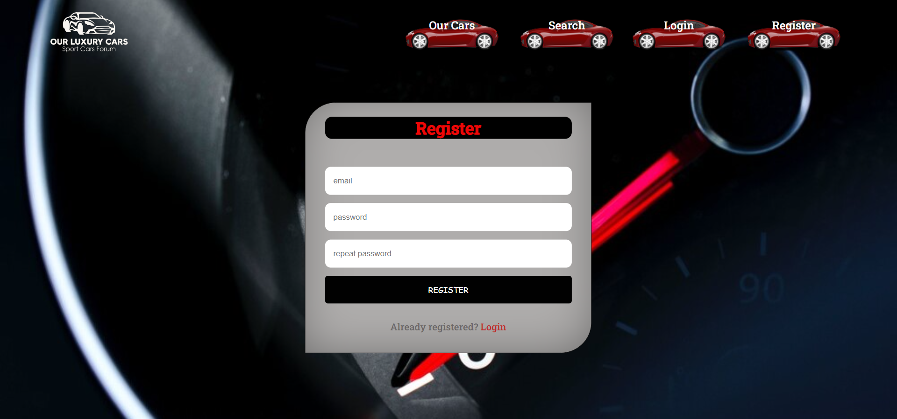

Send the following request to perform registration:
Method: POST
URL: /users/register
Required headers are described in the documentation. The service expects a body with the following shape:
{
email,
password
}
Upon success, the REST service will return the newly created object with an automatically generated \_id and a property accessToken, which contains the session token for the user – you need to store this information using sessionStorage or localStorage, in order to be able to perform authenticated requests.
If the registration was successful, redirect the user to the Home page. If there is an error, or the validations don’t pass, display an appropriate error message, using a system dialog (window.alert).

### Logout (5 pts)

The logout action is available to logged-in users. Send the following request to perform logout:
Method: GET
URL: /users/logout

The required headers are described in the documentation. Upon success, the REST service will return an empty response. Clear any session information you’ve stored in browser storage.
If the logout was successful, redirect the user to the Home page.

### Dashboard (15 pts)

This page displays a list of all cars in the system. Clicking on the More Info button in the car card leads to the details page for the selected car. This page should be visible to guests and logged-in users.

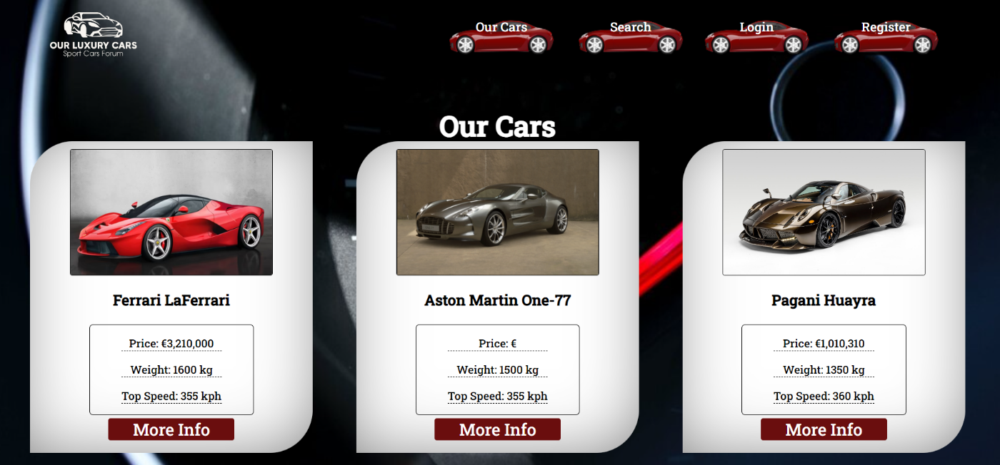

If there are no cars, the following view should be displayed:

Send the following request to read the list of records:
Method: GET
URL: /data/cars?sortBy=\_createdOn%20desc
The required headers are described in the documentation. The service will return an array of cars.

### Adding a New Car(15 pts)

The Create page is available to logged-in users. It contains a form for adding a new car. Check if all the fields are filled before you send the request.

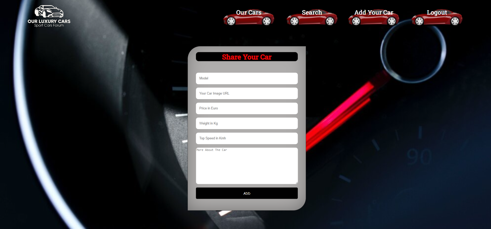

To create car record, send the following request:
Method: POST
URL: /data/cars
The required headers are described in the documentation. The service expects a body with the following shape:
{
model,
imageUrl,
price,
weight,
speed,
about
}
The required headers are described in the documentation. The service will return the newly created record. Upon success, redirect the user to the Our Cars page.

### Car Details (10 pts)

All users should be able to view details about car. Clicking the More Info button in a car card should display the Details page. If the currently logged-in user is the creator, the Edit and Delete buttons should be displayed. Otherwise, they should not be available. The view should look like this to the creator of the car record:

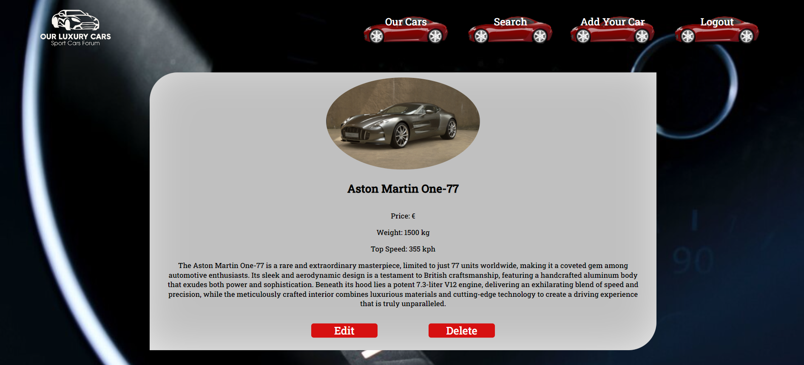

The view for guests and registered users who have not created the car record should look like:

Send the following request to read a single car:
Method: GET
URL: /data/cars/:id
Where :id is the ID of the desired card. The required headers are described in the documentation. The service will return a single object.

### Editing a Car Record (15 pts)

The Edit page is available to logged-in users and it allows authors to edit their own car records. Clicking the Edit link of a particular car on the Details page should display the Edit page, with all fields filled with the data for the car. It contains a form with input fields for all relevant properties. Check if all the fields are filled before you send the request.

To edit a car record, send the following request:
Method: PUT
URL: /data/cars/:id
Where :id is the id of the desired card.
The service expects a body with the following shape:
{
model,
imageUrl,
price,
weight,
speed,
about
}
Required headers are described in the documentation. The service will return the modified record. Note that PUT requests do not merge properties and will instead replace the entire record. Upon success, redirect the user to the Details page for the current car.

### Delete a Car Record (10 pts)

The delete action is available to logged-in users, for car records they have created. When the author clicks on the Delete action on any of their car, a confirmation dialog should be displayed, and upon confirming this dialog, the record should be deleted from the system.
To delete car record, send the following request:
Method: DELETE
URL: /data/cars/:id
where :id is the id of the desired car. Required headers are described in the documentation. The service will return an object, containing the deletion time. Upon success, redirect the user to the Our Cars page.

### (BONUS) Search Page (15 pts)

The Search page allows both logged-in users and guests to filter cars by their model. It contains an input field and, upon submitting a query, a list of all matching cars. Check if the field is filled before you send the request. If it isn't filled show an alert message.
By default, or if you don't find some cars records, the following view should be displayed:

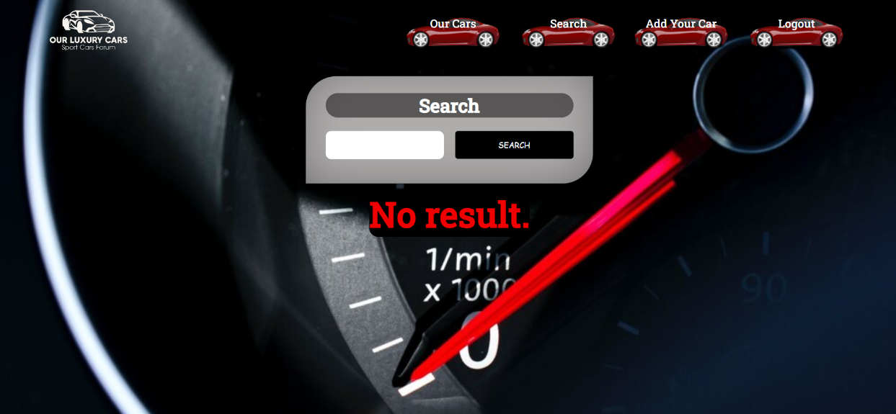

If you find cars, the following view should be displayed:

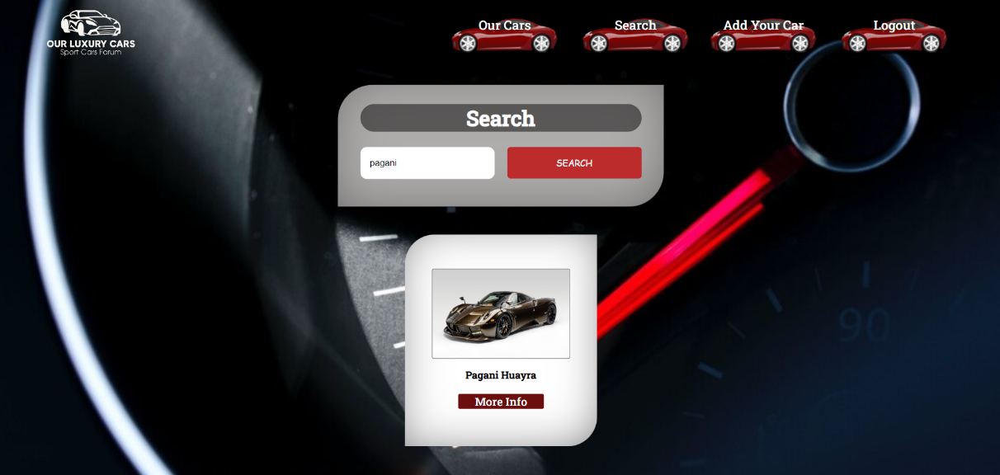

Send the following request to read a filtered list of cars by their name:
Method: GET
URL: /data/cars?where=model%20LIKE%20%22${query}%22

Where {query} is the search query that the user has entered in the input field. Required headers are described in the documentation. The service will return an array of cars.

### 4\. Appendix A: Using the Local REST Service

### Starting the Service

The REST service will be in a folder named “server” inside the provided resources archive. It has no dependencies and can be started by opening a terminal in its directory and executing:
**node server.js**
If everything is initialized correctly, you should see a message about the host address and port on which the service will respond to requests.

### Sending Requests

To send a request, use the hostname and port, shown in the initialization log and resource address and method as described in the application requirements. If data needs to be included in the request, it must be JSON-encoded, and the appropriate Content-Type header must be added. Similarly, if the service is to return data, it will be JSON-encoded. Note that some requests do not return a body and attempting to parse them will throw an exception.
Read requests, as well as login and register requests do not require authentication. All other requests must be authenticated.

### Required Headers

To send data to the server, include a Content-Type header and encode the body as a JSON-string:

Content-Type: application/json
{JSON-encoded request body as described in the application requirements}
To perform an authenticated request, include an X-Authorization header, set to the value of the session token, returned by an earlier login or register request:
X-Authorization: {session token}

### Server Response

Data response:
HTTP/1.1 200 OK
Access-Contrl-Allow-Origin: \*
Content-Type: application/json

{JSON-encoded response data}
Empty response:
HTTP/1.1 204 No Content
Access-Contrl-Allow-Origin: _
Error response:
HTTP/1.1 400 Request Error
Access-Contrl-Allow-Origin: _
Content-Type: application/json
{JSON-encoded error message}

More Information
You can find more details on the [GitHub repository of the service](https://github.com/softuni-practice-server/softuni-practice-server/blob/master/README.md)

### 5\. Appendix B: Running the Test Suite

### Project Setup

The tests require a web server to deliver the content of the application. There is a development web server included in the project scaffold, but you may use whatever server you are familiar with. Note that specialized tools like BrowserSync may interfere with the tests. To initialize the project with its dependencies, open a terminal in the folder, containing the file package.json and execute the following:
**npm install**
Note that if you changed the section **devDependencies** of the project, the tests may not initialize properly.

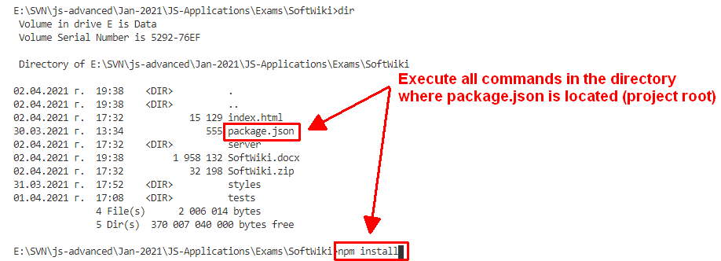

### Executing the Tests

Before running the test suite, make sure a web server is operational, and the application can be found at the root of its network address. To start the included dev-server, open a terminal in the folder containing package.json and execute:
**npm run start**

This is a one-time operation unless you terminate the server at any point. It can be restarted with the same command as above.
To execute the tests, open a new terminal (do not close the terminal, running the web server instance) in the folder containing package.json and execute:
**npm run test**

Test results will be displayed in the terminal, along with detailed information about encountered problems. You can perform this operation as many times as it is necessary by re-running the above command.

### Debugging Your Solution

If a test fails, you can view detailed information about the requirements that were not met by your application. Open the file e2e.test.js in the folder tests and navigate to the desired section as described below.
This first step will not be necessary if you are using the included web server. Make sure the application host is set correctly:

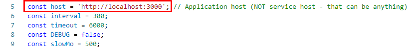

The value for host must be the address where your application is being served. Make sure that entering this address in a regular internet browser shows your application.
To make just a single test run, instead of the full suite (useful when debugging a single failing test), find the test and append .only after the it reference:

On slower machines, some of the tests may require more time to complete. You can instruct the tests to run more slowly by slightly increasing the values for interval and timeout:

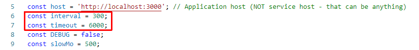

Note that interval values greater than 500 and timeout values greater than 10000 are not recommended.
If this doesn’t make the test pass, set the value of DEBUG to true and run the tests again – this will launch a browser instance and allow you to see what is being tested, what the test sees and where it fails (or hangs):

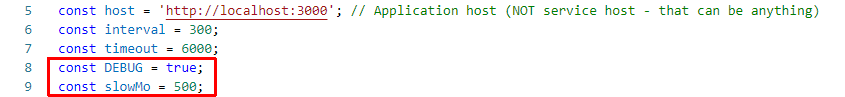

If the actions are happening too fast, you can increase the value of slowMo. If the browser hangs, you can just close it and abort any remaining tests by focusing the terminal window and pressing [Ctrl+C] followed by the letter "y" and [Enter].
The final thing to look for is the exact row where the test fails:

### 6\. Result
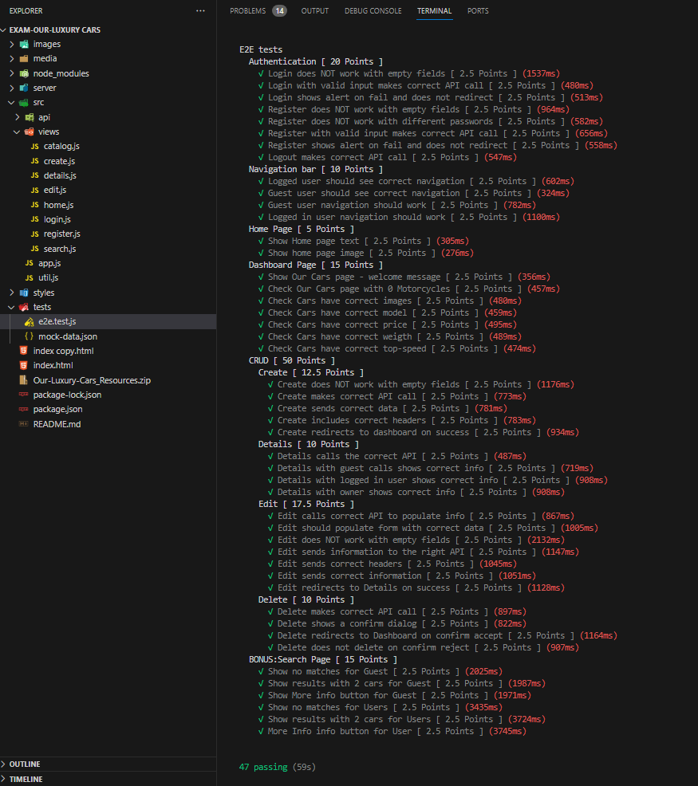
